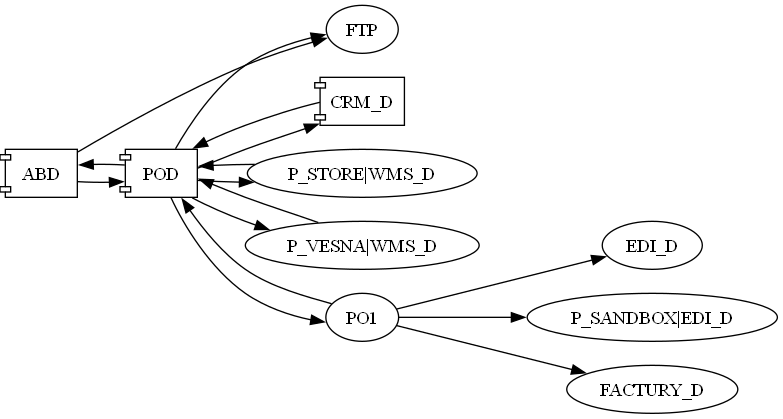

# Пользовательский ландшафт, организация Карта_ООО

## Карта_ООО использует системы, см. ниже.
### ABAP
* ABD-100, ABD-110 -- разработка, два манданта для примера
* ABT-400, ABT-410, ABP-400 -- тест(1/2) и продуктив
### PO
* Разработка: POD (central) + PO1 (DMZ)
* Тест: POT (central) + PO3 (DMZ)
* Продуктив: POP (central) + PO5 (DMZ) + POR (non-central)
### CRM: собственный хостинг
### WMS: собственный хостинг
### EDI: система в интернете
### FACTURY: система в интернете
### FTP: просто SFTP

## Адресация
Карта_ООО это две площадки: офис + осн.склады и площадка "Весна" с небольшим складом.

### Шаблоны названий
Короткие имена, `<sid>###` для абапа, `<NAME>_suffix` для прикладных, INTEGRATION_ENGINE_JAVA_<sid> по стандарту PO.
Имена интерфейсов вида: {urn:rsugio-karta:erp}SI_019Payments_OutAsync где 019 это условный номер разработки.

### Список
ABD100, ABD110, ABT400, ABP400 -- используются для интеграции
CRM_D, CRM_T, CRM_P -- в офисе, без партий
P_STORE|WMS_D, WMS_T_, WMS_P -- в главном складе
P_VESNA|WMS_D, WMS_T_, WMS_P -- на площадке Весна
POD -- INTEGRATION_ENGINE_JAVA_POD

Для EDI введены: EDI_D, EDI_T, EDI_P с продуктивным адресом API; P_SANDBOX|EDI_D P_SANDBOX|EDI_T с песочницей.
Для FACTURY нет песочницы, поэтому просто FACTURY_D|T|P.

Доступ к EDI и FACTURY возможен только через PO-DMZ, для CRM работает central.

## Хосты
hostdb<sid> - БД, hostapp<sid> - приложение -- для ABAP, PO.
hostapp<suffix> -- для прочих (суффикс произвольный).

## Схема tcp-соединений
UserCallGraph.uml: 

Самая обычная схема с DMZ.

## Подход к объектам Directory
PO 7.5, отдельные SA/RA/ReceiverRule не используются.

Каналы на af.pod.hostdbpod, кратко:
* |ABD100|CC_XISender, |ABD100|CC_IDocSender -- отправка из ABD100
* |ABD100|CC_XIReceiver, |ABD100|CC_IDocReceiver -- приём в ABD100
* |INTEGRATION_ENGINE_JAVA_POD|CC_XIReceiver_DMZ - из POD -> PO1, на стороне центрального
* |CRM_D|CC_RESTReceiver_019Payments
* 
Каналы на af.po1.hostdppo1:
* |INTEGRATION_ENGINE_JAVA_PO1|CC_XISender - из POD -> PO1, на стороне DMZ
* |INTEGRATION_ENGINE_JAVA_POD|CC_XIReceiver - из PO1 -> POD, на стороне DMZ

## Сценарии
* ABD100 -> POD -> CRM_D, {urn:rsugio-karta:erp}SI_019Payments_OutAsync -> {urn:rsugio-karta:crm}SI_019Payments_InAsync
